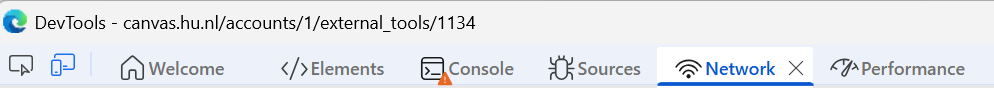
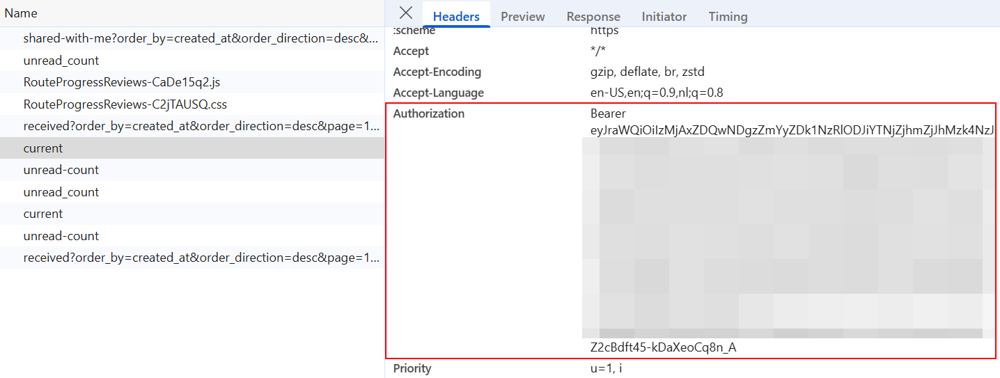

# Portflow Evaluatie Exporter (Visual Dashboard)

Een eenvoudige, lokaal te draaien visuele uitbreiding op het fantastische originele werk van [ntaheij/PythonPortflow](https://github.com/ntaheij/PythonPortflow).

Dit project haalt evaluaties en feedback op van studenten uit Portflow en toont deze in een prachtig ontworpen, lokaal web-dashboard in HU-huisstijl. Je kunt de voortgang van studenten in één oogopslag zien en de resultaten overzichtelijk exporteren of printen.

---

## 🚀 Hoe begin ik?

De makkelijkste manier om te starten is door de bestanden op je computer op te slaan en onze interactieve gids te gebruiken.

1. Download of clone deze repository naar je computer.
2. Open het bestand **`START_HERE.html`** door erop te dubbelklikken.
3. Volg de super simpele instructies in je browser voor jouw werkwijze (Windows, Mac, of VS Code) om de applicatie te starten.

## 🔑 Bearer-token ophalen

Om in te loggen in je lokale dashboard heb je een persoonlijke "Bearer Token" van Canvas nodig. Mocht je niet weten hoe je deze vindt, volg dan deze stappen:

1. [Open Portflow](https://canvas.hu.nl/accounts/1/external_tools/1134) via Canvas in je browser.
2. Rechtsklik ergens op de pagina en kies **Inspect / Inspecteren**.


3. Ga in het nieuwe paneel naar het tabblad **Network / Netwerk**.



4. Navigeer in Canvas/Portflow naar een andere pagina (bijv. Evaluatieverzoeken).
5. Zoek in de lijst met requests naar een bestand genaamd `dashboard`, `sections` of `current` (sla de `.css` en `.js` bestanden over).
6. Klik erop, scroll naar de **Request Headers** en kopieer de lange code die direct achter `Authorization: Bearer` staat (dit begint vaak met `eyJ...`).



7. **Kopieer deze token en plak het direct in het inlogscherm van je lokale dashboard!**

*(Let op: deel deze token nooit met anderen!)*

---

## 💻 Voor de Developers

### Applicatie Starten
Installeer de Python libraries en start de app direct via je terminal:
```bash
pip install -r requirements.txt
python3 portflow_export.py
```
De applicatie start automatisch je browser en is te bereiken op `http://127.0.0.1:8080`.

### Klassieke CLI Mode
Mocht je de voorkeur geven aan de originele, tekstuele command-line interface in plaats van de visuele interface, start het script dan met de `--cli` flag:
```bash
python3 portflow_export.py --cli
```

---
*Originele CLI-backend script gebouwd door [ntaheij/PythonPortflow](https://github.com/ntaheij/PythonPortflow). Visueel web-dashboard ontworpen en toegevoegd door lalamaker.*